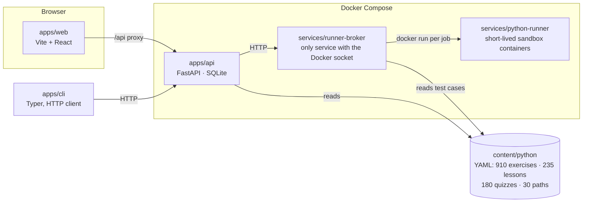

# Agent guide

Learn Code is a local, Dockerized platform for learning Python: original
autograded exercises, lessons, quizzes, and curated learning paths, served by
a FastAPI backend to a Vite/React app and a Typer CLI, with learner code
executed in sandboxed containers.

## Codebase map



Key modules inside `apps/api/learn_code_api/`:

- `content/` — YAML loader, pydantic models, the validator (structure,
  references, path prerequisite ordering, sample-solution execution), and the
  concept taxonomy with display labels (`concepts.py`).
- `services/` — path progress (always derived, never stored), submissions,
  runs, reviews, the adaptive planner, timed practice.
- `routers/` — thin FastAPI routers over the services; contracts live in
  `contracts/`.
- `progress/` — the SQLite repository. The API is the only SQLite writer.

Other load-bearing pieces:

- `scripts/generate_paths.py` — regenerates all 30 path YAMLs from the content
  bank: unit ordering, quiz interleaving, milestones, and each path's
  `assumed_concepts` (prior knowledge the path presumes, computed from
  lesson-taught concepts).
- `scripts/check_repo.py` — repo guard; among other things it fails if any
  external URL appears in `apps/web` (the app is offline-capable).
- `content/python/library/<area>/` — one YAML per item; `kind:` is exercise,
  lesson, or quiz. Paths live in `content/python/paths/`.

## Commands

```bash
uv sync --all-packages    # one-time setup: whole workspace, editable, into .venv
make validate     # repo guard + compose config + all pytest + web build
make test         # all pytest + web vitest
uv run scripts/generate_paths.py               # after content changes
uv run learn-code validate-content
docker compose up --build                      # full stack on :5173
```

Python packaging is a uv workspace (root `pyproject.toml`, single `uv.lock`);
after changing any dependency run `uv lock` and commit the lockfile.
Python suites also run individually: `cd apps/api && python -m pytest`.
Web: `cd apps/web && npm test -- --run` and `npx tsc -b --noEmit`.

## Rules that will fail your PR if ignored

- **PRs target `dev`**, not `main`.
- **All content must be original.** Nothing copied or paraphrased from
  LeetCode, HackerRank, or any other problem site. Provenance metadata is
  scanned for platform names.
- **Every exercise ships ≥3 public and ≥3 validation tests**, and its sample
  solution must pass them (validation executes it).
- **Paths must teach prerequisites before items need them**; whatever a path
  doesn't teach must be in its `assumed_concepts`. Don't hand-edit path YAML —
  change `scripts/generate_paths.py` and regenerate.
- **No external URLs in `apps/web`** — fonts and assets are self-hosted; the
  repo guard blocks regressions.
- **Concept ids must exist in the taxonomy** (`LIBRARY_KNOWN_CONCEPTS` in
  `content/validator.py`) and have labels in `content/concepts.py` — a test
  keeps the two in lockstep.
- **Only `services/runner-broker` may mount the Docker socket.**

## Conventions

- Python: FastAPI + pydantic v2, `from __future__ import annotations`,
  100-char lines (ruff). Comments explain constraints, not narration.
- Web: React function components, TanStack Query for data, contracts mirrored
  by hand in `src/contracts/index.ts` — update both sides together.
- Progress and path completion are **derived at read time**, never stored.
- Tests live next to their suite (`apps/api/tests`, `apps/cli/tests`,
  `services/runner-broker/tests`, `*.test.tsx` in the web app).
